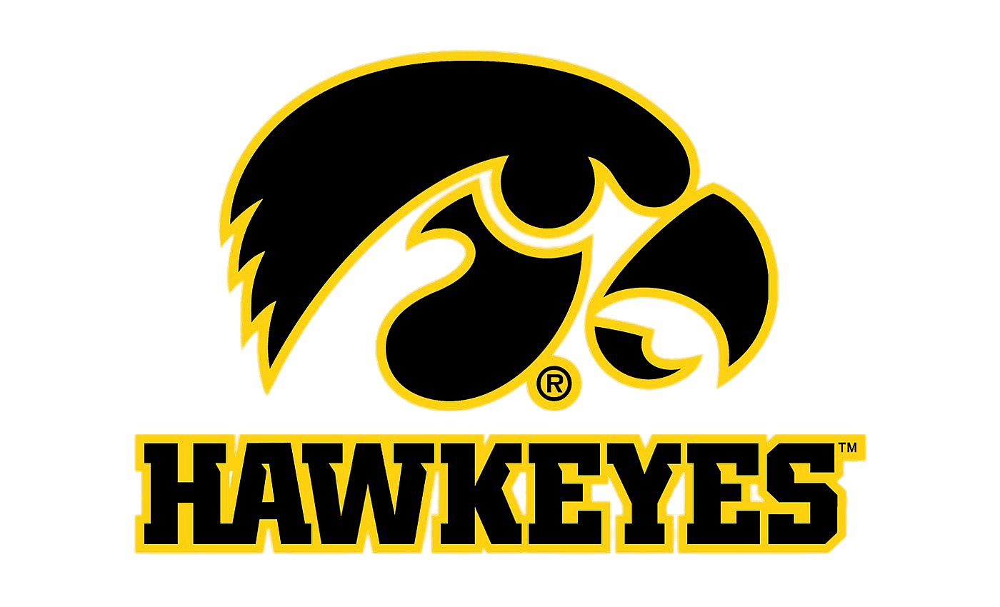
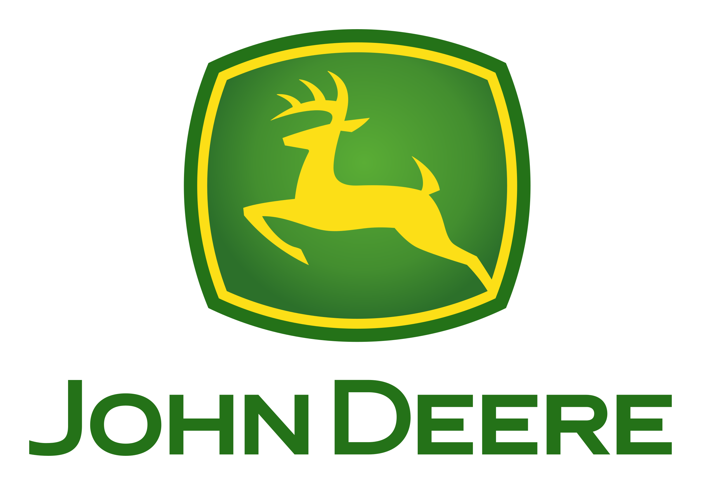

    
    
    

## 💻 Experience
### PART-TIME STUDENT PRODUCT ENGINEER
**John Deere, ISG | Urbandale, IA** (April 2024 - Present)
- Create stakeholder-facing dashboard applications written in Python
- Develop embedded robotics pipelines to push product development
- Collaborate in large team to enhance workflow, learn new frameworks, and employ new techniques

### PART-TIME STUDENT DEVELOPER
**FarrPro | Iowa City, IA** (Aug. 2023 - April 2024)
- Assisted in website development using React JS
- Coordinated with small team of developers
- Assisted in LLM training with project specific information

### PROJECT LIAISON INTERN
**FarrPro | Iowa City, IA** (June 2023 - Aug. 2023)
- Created website prototypes using Figma to influence project development
- Collaborated with grant writing professionals in board meetings
- Presented designs to potential clients

## 🎓 Education
**COMPUTER SCIENCE AND ENGINEERING B.S.E.**  
College of Engineering | University of Iowa, Iowa City, IA (Expected May 2026)
- GPA: 3.65
- Dean's List 2022 & 2023

**Ankeny Centennial High School | Ankeny, IA**
- Cumulative GPA: 4.32
- National Honor Society

## 💬 Languages
- Python
- Java
- C++
- JavaScript
- HTML
- CSS
- Verilog